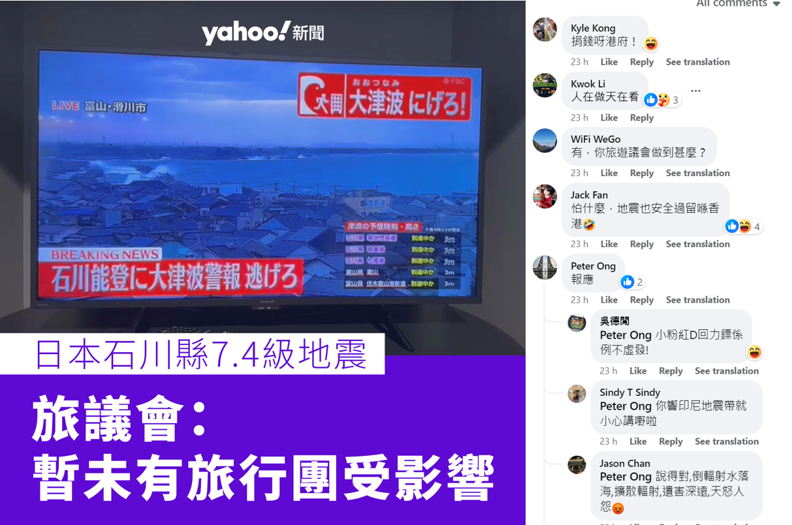
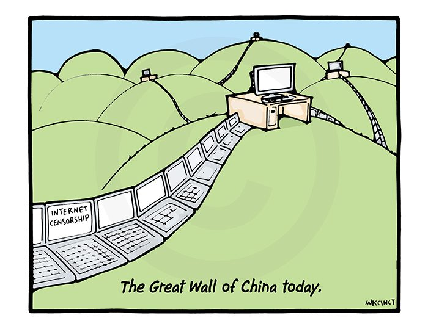

# Will China’s Internet Influence Diminishes Our Way Of Life?  

Keywords: digital identities, existential risks, China, The Great Firewall, way of life, censorship, surveillance
## Introduction
In recent years, Chinese social media and e-commerce platforms such as Tiktok and Temu have gained a lot of popularity. Although the western tech companies still occupied most of the online landscape, the tide might turn. The influence of Chinese companies are gradually increasing as stated by Enrique Dans, Tiktok and Temu ranked the first and the sixth most downloaded apps which contributed to 50 million and 24 million downloads in September 2023[^2]. On the other hand, western companies like eBay failed to profit from China's users[^1]. The popularity of Chinese apps have raised a lot of concern to the public due to their policies and usages may compromise the cybersecurity of individuals and even national security. Misinformation in Tiktok is extremely common as deepfake and editing technologies become easily accessible, and with its 1.6 billion active users, the risk of manipulation of the public is a tangible and imminent threat[^3].

I will investigate China's one of the territory that is excluded from China's Great Firewall and have full access to the internet, Hong Kong. After the 2019 protests, China has strengthened the control of Hong Kong which included the usage of the internet to stablise Hong Kong's civil unrest. As Hong Kong is a previous British colony, this can be a benchmark of what can happen if China uses the internet as a tool to fulfil its goal.

  
## Main body

### China's The Great Firewall

<iframe width="1000" height="500" src="https://www.youtube.com/embed/pzPxidiBNJQ?si=f1LBtDb3P1jebIsE" title="YouTube video player" frameborder="0" allow="accelerometer; autoplay; clipboard-write; encrypted-media; gyroscope; picture-in-picture; web-share" allowfullscreen></iframe>

Based on the study of Shawn Healy, the Great Firewall of China is an internet censorship system combined the usages of both governmental and private assets which uses 9 state-owned companies to manually blocking websites that are deemed to be violated the principle of the Chinese socialist morality. Various types of websites are blocked including pornographic and websites that spread hate speech but also for websites that mentioned about sensitive history, homosexuality and news publication[^4]. In addition, self-censorship policy is introduced to ensure private-owned websites to be accountable for violations.
  
<iframe width="1000" height="500" src="https://www.youtube.com/embed/ajR9J9eoq34?si=hJQBMb5zhjUqFEIs" title="YouTube video player" frameborder="0" allow="accelerometer; autoplay; clipboard-write; encrypted-media; gyroscope; picture-in-picture; web-share" allowfullscreen></iframe>
  
Furthermore, the video above created by SCMP stated that foreign websites such as Facebook and NewYork TImes are blocked. Instead, alternatives are created for Chinese netizens to access but even these home-bred apps and websites have strict surveillance and control by adopting the real-name system. ID number, phone number and real name are required to register any accounts for these websites. Because of that, privacy in Chinese internet does not exist and "big brother' is always watching from behind.

### Case study: Hong Kong as the frontline of China’s internet interference  
Hong Kong is a unique location that inherited democratic system and ideology as the United Kingdom’s colony before 1997. It is one of the few areas in China territory that is not included inside China’s Great FireWall that has limits of speech and heavy surveillance. Therefore, the environment of Hong Kong’s internet was the same as western nations that enjoyed a high degree of freedom of speech. This resulted in internet culture that is a mixture of Chinese culture with the usage of western online platforms including Facebook, Instagram and also local social medias and forums such as 9GAG and HKGolden.  

#### Freedom of choice
After Taobao is founded in 2003, it is accessible to all Chinese-speaking regions and as a result Hong Kong became one of its customer base. After the implementation of Alipay, a electric payment app using QR code technology, Taobao defeated Ebay and became the largest online shopping platform in China [^5]. This allows Hong Kong people to enjoy domestic products from heavy machinary to toothbrush with a low cost and high accessibility.  

However, the heavy reliant on Taobao has introduced the censorship of Mainland China to Hong Kong in the form of restricting the right to buy. During the 2014 Hong Kong protest, the umbrella has become a symbol of the pro- democratic movement and used as tool to conceal from surveillance. As a result, Taobao and Aliexpress refused to sell umbrellas to Hong Kong customers for the stabilization of Chinese authoritarian reign.[^6]  

#### The new denunciation rallies

The affect of booming Chinese internet's services development not only grant Chinese civilian's access to the walled internet but also easier access to the outside world. 
However, this led to a cultural conflict between mainland and Hong Kong on the internet. The 50 cents party and little pink are both unique pro-China groups that have similar features. According to Henry Farrell, 50 cents party is a paid employee by the Chinese government to propagandize and stablelize the internet environment from any political disturbance using distraction tactics, in the other hand little pink is unpaid civilians that take a pro-China stance with no specific duty like the 50 cents party[^7].

Although both are zealots praising China’s government, little pinks are the main issue in the context of Hong Kong’s internet. Unlike 50 cents party which focuses on China’s walled internet, little pinks are ordinary civilians who have no restriction from duty that are more aggressive and hostile to other groups and even nations. In the internet of China, it is a norm to attack and laugh at other nations and opposed groups by netizens such as the recent frequent accidents from Japan are celebrated by Chinese internet users[^8]. This kind of culture from mainland China is clashing with the more pacifist and liberal mindset of Hong Kong's internet users as it has come into Hong Kong.

As seen in the above Yahoo News’ post on Facebook which is about Japan's earthquake, there are commentators saying it is karma for Japan leading to other commentators' revolt[^9]. 
In some way, little pinks are similar to the denunciation rallies in the Maoist China that are both loose cannons supporting China’s ruling party without any protocols which result in the most damaging influence to Hong Kong’s internet harmony. In addition, this kind of behavior creates a hostile environment on the internet for all users and eliminates rational and multi-perspective discussions, leading to homogeneity and information bubbles on Hong Kong’s internet. 

#### Influence of China's capitol

The observation of Francis L. F. Lee concludes that although Hong Kong's medias have sucessfully converted its
While Hong Kong's medias were able to convert its medium into the internet using Facebook, websites and alternative medias, the influence of China's capitol is obvious. According to Francis L. F. Lee, 15 shareholders of main medias from different period after 1997 have relationship with the Chinese communist party or government which lead to self censorship and introducing the dilemma between professionalsm or political correctness[^10]. As majority of Hong Kong medias are composed of China's assets, the perspective from medias are very likely to be biased or even worse they are manipulated by institution. For further control of the medias in Hong Kong, investments are easily pull out from any medias that have point of views that are at risk of destabilizing China's reign.

Changing Political Economy of the Hong Kong Media  
https://journals.openedition.org/chinaperspectives/8009  
self censorship
Control the media, control in crowd  

### Discussion
As the portion of Chinese apps gradully increasing for the users internet usage, there are greater chance of surveillance and even manipulation. https://www.theguardian.com/world/2023/sep/28/chinas-manipulation-of-media-threatens-global-freedoms-says-us-report  

It is a controversal topic about whether Internet needs a total freedom environment or a strict one like China's. In recent years, we can see how the internet is used to spread hate and misinformation such as antisemitism. Even though the controlled China's internet and its apps are in heavy censorship and surveillance, the environment seems to be more peaceful or at least one that have unified point of view.  Culture is one of the major factors of why the internet of China and the west are completely different

SCMP

In an imaginative view, China's Internet Great Wall is out of bound and expanded to the home front of western nations. Whether it is in good intention or not, it will affect the way of life of everyone

Reccomendation
In addition, the only important question is that can we trust China to harness the power of the internet and not exploit it? Google, Facebook are American companies and have very similar ethics and culture to all western civilizations. Although they technically have all the personal informations and algorithms, their objectives are mostly  promoting a products. But can we ensure China as a collectivism country that emphasize on stability rather than privacy is still a ongoing debate.  
There are two kinds of option in this environment, one is to embrace and trust China not to use the internet as a tool for its reign or avoid any Chinese apps to ensure your way of life.  

## Conclusion

##Reference  

[^1]: Carol Xiaojuan Ou, Robert M. Davison Technical opinion:Why eBay lost to TaoBao in China: the Glocal advantage Published in [Communications of the ACM, Volume 52, Issue 1](https://doi.org/10.1145/1435417.1435450)

[^2]: Enrique Dans 2023 Should we be worried about the popularity of Chinese apps in the West? Published in 
[Medium](https://medium.com/enrique-dans/should-we-be-worried-about-the-popularity-of-chinese-apps-in-the-west-15f2035820f9#:~:text=AppFigures'%20global%20ranking%20of%20the,holds%20the%20number%20one%20spot.)

[^3]: Tiffany Hsu 2022 Worries Grow That TikTok Is New Home for Manipulated Video and Photos Published in 
[New York Times](https://www.nytimes.com/2022/11/04/technology/tiktok-deepfakes-disinformation.html)

[^4]: Shawn Healy 2007 The great firewall of China. Published in 
[National Council for the Social Studies](https://www.socialstudies.org/system/files/publications/articles/se_7103158.pdf)

[^5]: Phang Wenxuan, Daisy Mui Hung Kee, Goh Jing Yi, Lim Yee Chang, Yang Zheng Hong, Omar AmirIssue About Taobao for countries other than China Published In
[IJTHAP](https://ejournal.aibpmjournals.com/index.php/IJTHAP/article/view/594)

[^6]: Tim Adams The big picture: umbrellas shielding democracy in Hong Kong Published In 
[The Guardian](https://www.theguardian.com/artanddesign/2022/dec/11/the-big-picture-umbrellas-shielding-democracy-in-hong-kong)

[^7]: Henry Farrell The Chinese government fakes nearly 450 million social media comments a year. This is why. Published In 
[WashingtonPost](https://www.washingtonpost.com/news/monkey-cage/wp/2016/05/19/the-chinese-government-fakes-nearly-450-million-social-media-comments-a-year-this-is-why/)

[^8]: Yahoo Taiwan News Japan Ishikawa earthquake Published In 
[YahooTaiwanNews ](https://tw.news.yahoo.com/%E7%B4%A0%E8%B3%AA%E5%91%A2-%E6%97%A5%E6%9C%AC7-6%E5%BC%B7%E9%9C%87%E5%BE%8C-%E9%A3%9B%E6%A9%9F%E7%9B%B8%E6%92%9E%E8%B5%B7%E7%81%AB-%E4%B8%AD%E5%9C%8B%E7%B6%B2%E5%8F%8B%E7%AB%9F%E5%96%8A-102507075.html)

[^9]: Yahoo Hong Kong News Japan Ishikawa earthquake Published In 
[YahooHongKongNews' Facebook page](https://www.facebook.com/YahooHongKongNews/posts/pfbid06j4aFX9w5A8cHXtdsMdko3G7J2SRiQ9RMMjMcCuhzF4atz4CkFKWfwQuCo2chMxyl)

[^10]: Francis L. F. Lee Changing Political Economy of the Hong Kong Media Published In 
[China Perspectives](https://journals.openedition.org/chinaperspectives/8009)

